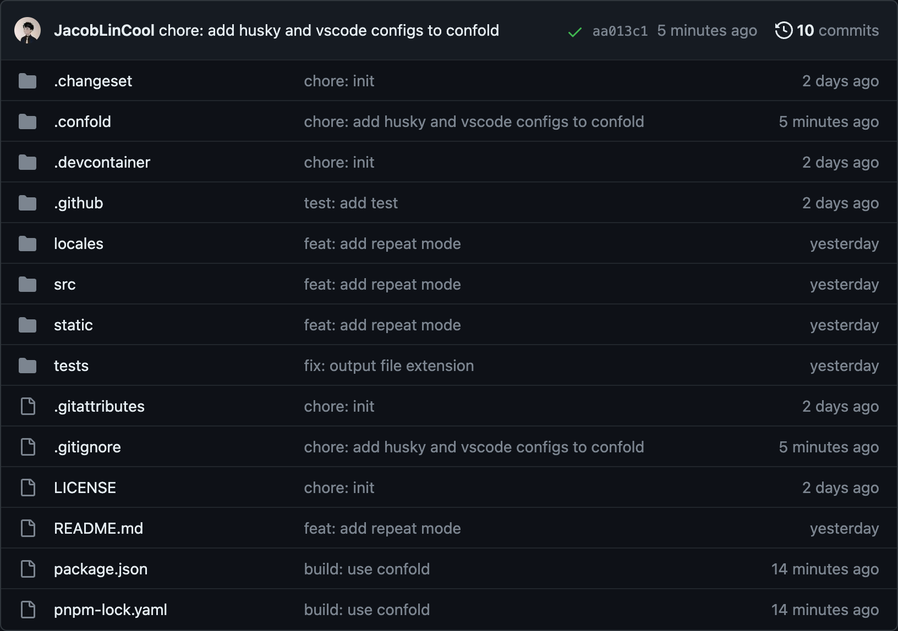

# Confold

Cleaning Up Config Chaos with Confold.

## Core Concepts

Confold is a robust tool designed to manage configuration files. It pairs seamlessly with git and integrates smoothly with existing projects.

By default, Confold handles top-level configuration files that are **excluded from `.gitignore`**. These files' states are maintained and monitored by files within the `.confold` directory via git.

Fundamentally, Confold performs one critical task: before a project is committed to git, it clones the state of tracked configuration files from the project root to the `.confold` directory. These files are then restored back to the project root whenever they are needed.

## Usage

### Initialization

```bash
confold init
```

Upon initialization, Confold generates a `.confold` directory in the project root and a `.confold` file within that directory. The `.confold` file is utilized to monitor the configuration files managed by Confold.

### Tracking

To have Confold manage a configuration file, follow these steps:

1. Add the configuration file to `.gitignore` for exclusion.
2. Append the configuration file name to `.confold/.confold`.
3. Execute `confold align` to align the configuration state with the `.confold` directory.

> `confold align` harmonizes the configuration file state between the project root and the `.confold` directory.

### Retrieval

To commence work on a project, execute `confold align`. This action syncs the configuration state from the `.confold` directory to the project root.

### Editing

Once you've retrieved the configuration file state, you're free to edit the configuration file as necessary.

Remember to execute `confold align` to ensure the updated configuration state is echoed back to the `.confold` directory after your edits.

## Git Hooks

Leverage git hooks to automate the process of syncing configuration file states.

Include `confold align` in the `pre-commit` hook to coordinate configuration file states before committing.

Add `confold align` to the `post-checkout` hook to synchronize configuration file states after checking out.

## Examples

### [Watermark App](https://github.com/JacobLinCool/watermark-app)

Watermark App is a SvelteKit application that uses lots of configuration files for dev servers, etc. Confold is used to manage these configuration files.

| Before                                 | After                                |
| -------------------------------------- | ------------------------------------ |
|  |  |
| 25 top-level entries                   | 14 top-level entry                   |
